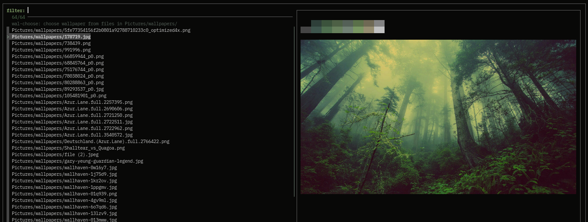

# wal-choose

a wallpaper and theme chooser built on fzf with pywal and ueberzug

the `wal` commands inside of wal-choose used to set the image for building a
theme or setting the theme to the previous one can be configured to use a
wrapper for pywal or a compatible command instead, tho note that the
replacement command should be capable to do BOTH recieve an image file or a
pywal theme file as input, no error checking whatsoever is done for the config
so you have been warned.

wal-choose will write the default config at
`"${XDG_CONFIG_HOME:-~/.config}/wal-choose/configrc"` if there's no config file

```sh
# my personal config, to use my setbg wrapper
# wal -i command
wal_img_cmd='setbg'
# wal --theme command
wal_thm_cmd='setbg -rn -t'
```


## Install

```sh
git clone https://github.com/eylles/wal-choose
cd wal-choose
make install
```


## screenshot




